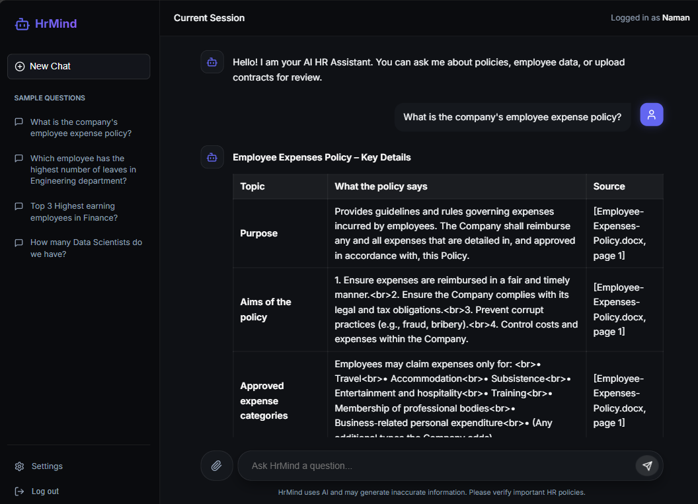
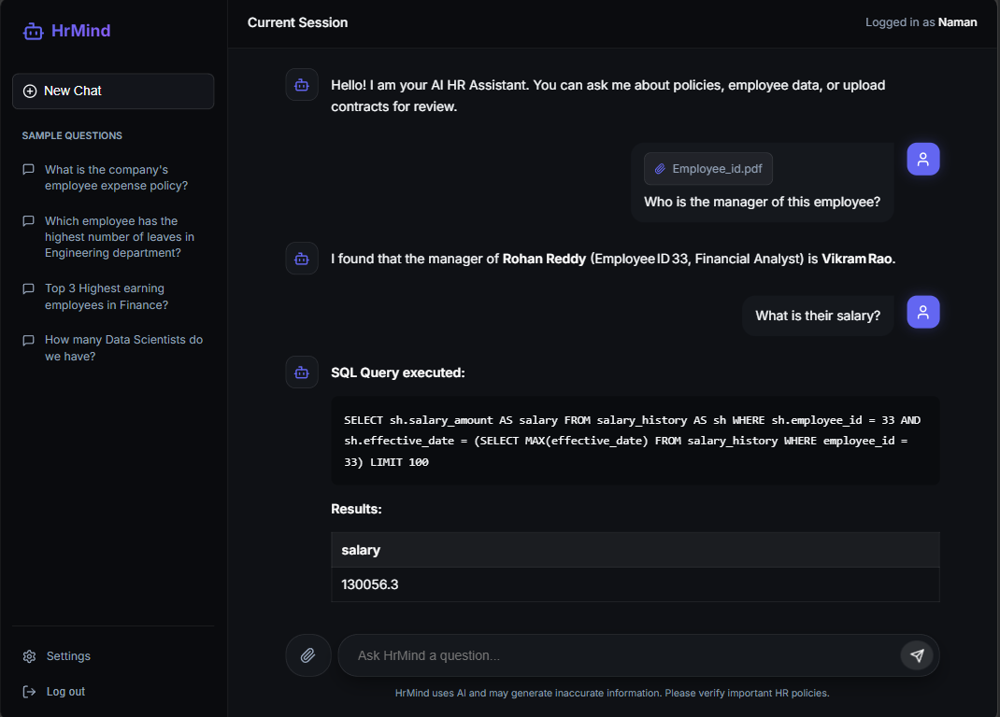
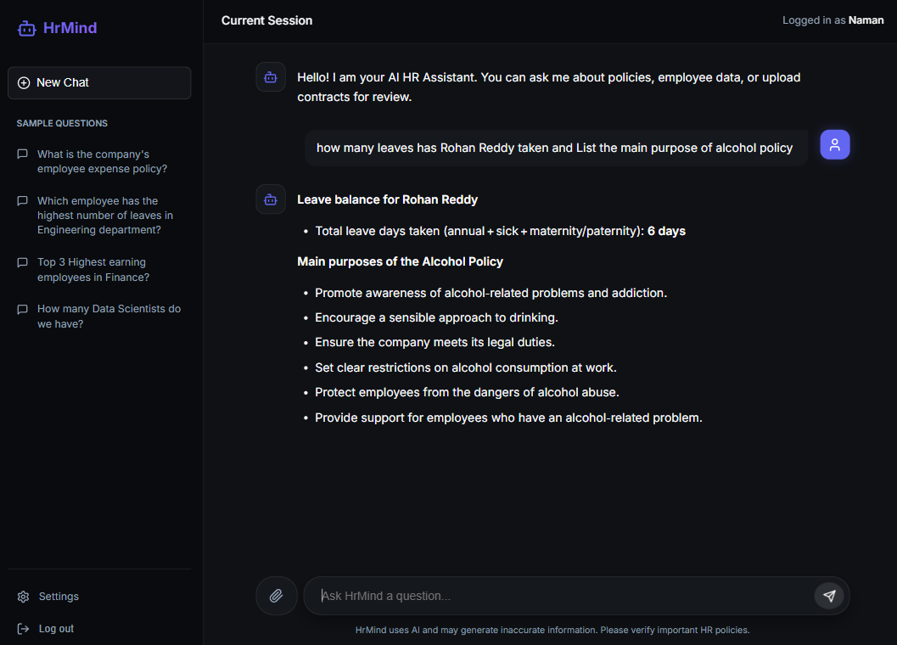

<div align="center">
  <h1>HrMind</h1>
  <p>Multi-Agent HR Intelligence Platform</p>
</div>

## Overview
**HrMind** is an advanced, AI-powered Human Resources Assistant designed to answer complex HR queries by synthesizing data from both structured databases and unstructured policy documents. It leverages a state-of-the-art multi-agent architecture built with **LangGraph** to orchestrate highly specialized AI agents, ensuring accurate, fast, and context-aware responses to user queries.

## Key Features
- **Conversational Chatbot Interface:** Beautiful, interactive UI built with React and Vite, featuring micro-animations, real-time typing indicators, and markdown rendering.
- **Multi-Agent Orchestration:** Specialized agents execute tasks in parallel or sequentially. The intelligent Supervisor agent evaluates user intent and routes tasks dynamically.
- **Retrieval-Augmented Generation (RAG):** Accurately answers policy-related questions by retrieving relevant context and chunked HR documents from a high-performance **ChromaDB** vector store.
- **Text-to-SQL (TextSQL):** Translates natural language questions into robust SQL queries to fetch structured employee, department, and payroll data from an **SQLite** database.
- **Document Parsing:** Allows users to upload contracts, resumes, and HR documents for instant analysis using a combination of OCR (Tesseract) and LLM-based information extraction.
- **Streaming Responses:** Provides real-time typing experiences via Server-Sent Events (SSE), making the chatbot feel highly responsive.
- **Memory Architecture:** Context builders inject short-term conversation history and entity extraction metadata into prompts to maintain context over long discussions.

## Architecture

HrMind employs a robust, event-driven backend architecture orchestrated by LangGraph:

### Core Nodes & Agents
- **Supervisor Agent:** The brain of the operation. It analyzes the user's query, identifies the underlying intent (Policy, Data, or Document Analysis), and routes it to the appropriate sub-agents. It inherently supports **parallel execution** for multi-faceted queries (e.g., asking for an employee's salary and the company's expense policy simultaneously).
- **RAG Agent:** Handles qualitative queries related to company policies, handbooks, and guidelines. It performs similarity searches against a ChromaDB vector index to retrieve the most relevant document chunks.
- **SQL Agent:** Handles quantitative queries related to structured data. It reads the HR database schema and writes, executes, and interprets SQLite queries.
- **DocParser Agent:** Analyzes uploaded files (PDFs, DOCX). It extracts raw text using python-magic and Poppler, then runs it through LLM-based extraction to answer specific questions about the document's contents.
- **Combiner Node:** Once the sub-agents finish their tasks, this node merges their discrete outputs into a single, cohesive, human-readable response.

### Database Schema (`hr.db`)
The SQL agent interacts with a comprehensive HR database schema containing:
- `departments`: Department structures and manager references.
- `employees`: Core employee records, job titles, and hire dates.
- `leave_balances`: Tracking annual, sick, and parental leave days.
- `salary_history`: Historical records of employee compensation.

## Guardrails
To ensure enterprise-grade reliability and security, HrMind implements comprehensive system guardrails:
- **Input Validation & Sanitization:** Cleans user inputs to prevent prompt injection and cross-site scripting (XSS) attacks.
- **Strict Query Scoping:** The SQL Agent is rigidly restricted to read-only (`SELECT`) operations. Write operations (`INSERT`, `UPDATE`, `DELETE`) are categorically blocked. It is also limited to specific schemas to prevent internal data leaks.
- **Hallucination Mitigation:** The RAG agent demands explicit citations. The system cross-verifies the LLM's response against the retrieved context; if the answer cannot be found in the vector store or database, the model is instructed to decline answering rather than hallucinate.
- **Data Privacy:** Sensitive Personally Identifiable Information (PII) is masked based on the user's authentication role and query intent.

## API Endpoints (FastAPI)
The backend exposes robust RESTful endpoints:

**Authentication**
- `POST /api/auth/register`: Create a new user account.
- `POST /api/auth/login`: Authenticate and generate a secure JWT access token.
- `GET /api/auth/me`: Fetch current logged-in user profile.

**Chat & Sessions**
- `POST /api/chat/stream`: Main interaction endpoint. Streams chatbot responses chunk-by-chunk using Server-Sent Events (SSE).
- `GET /api/sessions`: Manage, retrieve, and delete past chat histories.

**Document Uploads**
- `POST /api/upload`: Endpoint to upload, validate, and securely store documents temporarily for the DocParser agent.

**System**
- `GET /api/health`: Application health check and liveness probe.

## Screenshots & Query Execution

Here are some visual examples of HrMind in action:

### RAG Queries
HrMind efficiently retrieves policy information from the vector store and synthesizes it into a comprehensive answer, maintaining context across the conversation.


### Document Parser & TextSQL
The system can simultaneously analyze an uploaded document (like an employment contract) and query structured database tables.


### Parallel Execution of Agents
For multi-intent queries, HrMind's Supervisor delegates tasks to multiple agents in parallel, combining the results smoothly. 
*Example Query: "how many leaves has Rohan Reddy taken and List the main purpose of alcohol policy"*


## Local Development Setup

Follow these steps to run the application locally.

### 1. Backend Setup
We use `uv` for lightning-fast Python dependency management.

```bash
# Navigate to the project root
cd HrMind

# Create and sync the virtual environment using uv
uv sync

# Activate the virtual environment
# On Windows:
.venv\Scripts\activate
# On macOS/Linux:
source .venv/bin/activate

# Start the FastAPI server with hot-reloading
uvicorn backend.api.main:app --host 127.0.0.1 --port 8000 --reload
```

### 2. Frontend Setup
The frontend uses Vite and React.

```bash
# Navigate to the frontend directory
cd frontend

# Install Node dependencies
npm install

# Start the Vite development server
npm run dev
```

The frontend will be available at `http://localhost:5173` (or the port specified by Vite), and API requests will be proxied to the backend automatically.

## Tech Stack
- **Backend Core:** Python 3.11, FastAPI, Uvicorn
- **AI & Orchestration:** LangChain, LangGraph, OpenAI/Groq (LLMs)
- **Databases:** ChromaDB (Vector Store), SQLite (Relational Store)
- **Frontend Core:** React 18, Vite, React Router, TailwindCSS-inspired custom styling, Lucide React Icons
